# IaC-Secure-Gate: Complete Architecture Documentation

**Version:** 2.0
**Date:** February 2026
**Author:** Final Year Project - Cloud Security Automation
**Status:** Production Ready

---

## Table of Contents

1. [Executive Overview](#1-executive-overview)
2. [System Architecture](#2-system-architecture)
3. [Phase 1: Detection Architecture](#3-phase-1-detection-architecture)
4. [Phase 2: Remediation Architecture](#4-phase-2-remediation-architecture)
5. [Phase 3: Prevention Architecture](#5-phase-3-prevention-architecture)
6. [Data Flow Diagrams](#6-data-flow-diagrams)
7. [Security Architecture](#7-security-architecture)
8. [Cost Architecture](#8-cost-architecture)
9. [Performance Metrics](#9-performance-metrics)
10. [Terraform Module Structure](#10-terraform-module-structure)
11. [Appendix: CIS Controls Mapping](#11-appendix-cis-controls-mapping)

---

## 1. Executive Overview

### 1.1 What is IaC-Secure-Gate?

IaC-Secure-Gate is an automated cloud security system that **prevents**, **detects**, and **remediates** security misconfigurations in AWS infrastructure. Built entirely with Infrastructure as Code (Terraform), it provides continuous compliance monitoring aligned with the CIS AWS Foundations Benchmark, with a pre-deployment security gate that blocks violations before they reach AWS.

### 1.2 High-Level Architecture

```
╔══════════════════════════════════════════════════════════════════════════════════════════╗
║                            COMPLETE SECURITY ARCHITECTURE                                ║
╠══════════════════════════════════════════════════════════════════════════════════════════╣
║                                                                                          ║
║  ┌─────────────────────────────────────────────────────────────────────────────────────┐ ║
║  │                    PHASE 3: PREVENTION (GitHub Actions)                              │ ║
║  │    Developer → PR → [Checkov (286 checks)] + [OPA/Rego (7 policies)] → Gate        │ ║
║  │    MTTP: 0 seconds — violations never reach AWS                                     │ ║
║  └──────────────────────────────────┬──────────────────────────────────────────────────┘ ║
║                                     │ (merge allowed)                                    ║
║                                     ▼                                                    ║
║  ┌─────────────────────────────────────┐    ┌────────────────────────────────────────┐  ║
║  │       PHASE 1: DETECTION            │    │       PHASE 2: REMEDIATION             │  ║
║  │       (Passive Monitoring)          │    │       (Active Response)                │  ║
║  ├─────────────────────────────────────┤    ├────────────────────────────────────────┤  ║
║  │                                    │     │                                        │  ║
║  │  ┌───────────┐    ┌───────────┐    │     │  ┌─────────────┐                       │  ║
║  │  │CloudTrail │    │AWS Config │    │     │  │ EventBridge │                       │  ║
║  │  │  Audit    │    │Compliance │    │     │  │   Rules     │                       │  ║
║  │  └─────┬─────┘    └─────┬─────┘    │     │  └──────┬──────┘                       │  ║
║  │        │                │          │     │         │                              │  ║
║  │        │    ┌───────────┴───┐      │     │    ┌────┴────┬──────────┬─────────┐    │  ║
║  │        │    │ IAM Access    │      │     │    │         │          │         │    │  ║
║  │        │    │  Analyzer     │      │     │    ▼         ▼          ▼         │    │  ║
║  │        │    └───────┬───────┘      │     │ ┌──────┐ ┌──────┐ ┌──────┐        │    │  ║
║  │        │            │              │     │ │Lambda│ │Lambda│ │Lambda│        │    │  ║
║  │        ▼            ▼              │     │ │ IAM  │ │  S3  │ │  SG  │        │    │  ║
║  │  ┌─────────────────────────────┐   │     │ └──┬───┘ └──┬───┘ └──┬───┘        │    │  ║
║  │  │       SECURITY HUB          │   │     │    │        │        │            │    │  ║
║  │  │    (Centralized Findings)   │───┼─────┼────┘        │        │            │    │  ║
║  │  └─────────────────────────────┘   │     │             ▼        ▼            │    │  ║
║  │                                     │     │  ┌─────────────────────────┐      │    │  ║
║  └─────────────────────────────────────┘     │  │      DynamoDB           │      │    │  ║
║                                              │  │    (Audit Trail)        │      │    │  ║
║  ┌─────────────────────────────────────┐     │  └───────────┬─────────────┘      │    │  ║
║  │         DATA LAYER                  │     │              │                    │    │  ║
║  ├─────────────────────────────────────┤     │              ▼                    │    │  ║
║  │  ┌──────────┐  ┌──────────┐        │     │  ┌─────────────────────────┐      │    │  ║
║  │  │    S3    │  │    S3    │        │     │  │    SNS Notifications    │      │    │  ║
║  │  │CloudTrail│  │  Config  │        │     │  └───────────┬─────────────┘      │    │  ║
║  │  │   Logs   │  │ Snapshots│        │     │              │                    │    │  ║
║  │  └────┬─────┘  └────┬─────┘        │     │              ▼                    │    │  ║
║  │       │             │              │     │  ┌─────────────────────────┐      │    │  ║
║  │       └──────┬──────┘              │     │  │   Analytics Lambda      │      │    │  ║
║  │              ▼                     │     │  │   (Daily Reports)       │      │    │  ║
║  │  ┌─────────────────────────┐       │     │  └─────────────────────────┘      │    │  ║
║  │  │     KMS Encryption      │       │     │                                   │    │  ║
║  │  │    (Customer Key)       │       │     └───────────────────────────────────┘    │  ║
║  │  └─────────────────────────┘       │                                              │  ║
║  └─────────────────────────────────────┘                                              ║
║                                                                                          ║
║  Phase 2 remediation patterns ─── inform ───▶ Phase 3 prevention policies               ║
║  (The Feedback Loop: runtime insights become commit-time deny rules)                     ║
║                                                                                          ║
╚══════════════════════════════════════════════════════════════════════════════════════════╝
```

### 1.3 Key Benefits

| Benefit | Description |
|---------|-------------|
| **Pre-Deployment Prevention** | Blocks violations before they reach AWS (MTTP: 0s) |
| **Automated Detection** | Continuous monitoring of 233+ security controls |
| **Instant Remediation** | Sub-second response to security violations |
| **Complete Audit Trail** | Every action logged and traceable |
| **Cost Efficient** | €8.51/month - 57% under budget |
| **CIS Compliant** | Aligned with industry security benchmarks |
| **Infrastructure as Code** | 100% reproducible and version controlled |

---

## 2. System Architecture

### 2.1 Three-Phase Design

The system operates in three distinct phases, forming a closed feedback loop:

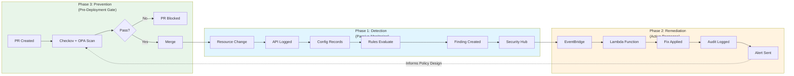

### 2.2 Component Summary

| Component | Phase | Purpose | Terraform Module |
|-----------|-------|---------|------------------|
| KMS | 1 | Encryption key for all logs | `foundation` |
| S3 Buckets | 1 | Secure log storage | `foundation` |
| CloudTrail | 1 | API audit logging | `cloudtrail` |
| AWS Config | 1 | Configuration recording | `config` |
| IAM Access Analyzer | 1 | External access detection | `access-analyzer` |
| Security Hub | 1 | Finding aggregation | `security-hub` |
| EventBridge | 2 | Event routing | `eventbridge-remediation` |
| Lambda (IAM) | 2 | IAM policy remediation | `lambda-remediation` |
| Lambda (S3) | 2 | S3 bucket remediation | `lambda-remediation` |
| Lambda (SG) | 2 | Security group remediation | `lambda-remediation` |
| DynamoDB | 2 | Remediation audit trail | `remediation-tracking` |
| SNS | 2 | Notifications | `self-improvement` |
| Lambda (Analytics) | 2 | Daily reporting | `self-improvement` |
| GitHub Actions | 3 | CI/CD security pipeline | `.github/workflows/` |
| Checkov | 3 | Static IaC scanning (286 checks) | `.checkov.yml` |
| OPA/Conftest | 3 | Custom policy evaluation (7 policies) | `policies/opa/` |

---

## 3. Phase 1: Detection Architecture

### 3.1 Detection Pipeline Overview

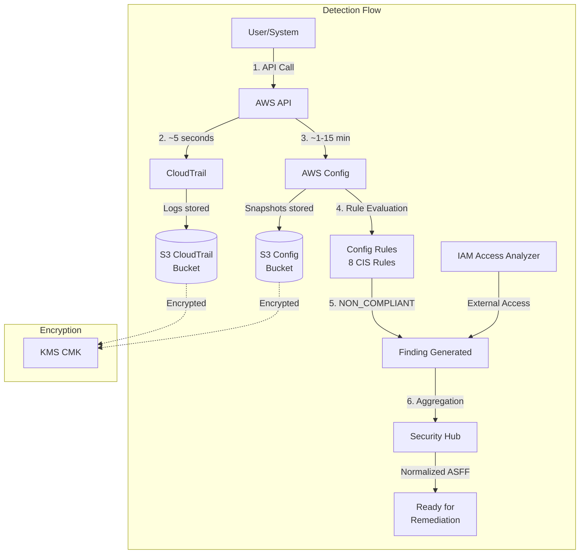

### 3.2 Component Details

#### 3.2.1 KMS Encryption Key

**Purpose:** Single customer-managed key encrypting all security data.

```
┌─────────────────────────────────────────────────────────────┐
│                    KMS Configuration                        │
├─────────────────────────────────────────────────────────────┤
│  Alias:            alias/iam-secure-gate-dev-logs           │
│  Key Rotation:     Automatic (Annual)                       │
│  Deletion Window:  7 days                                   │
│  Authorized:       CloudTrail, Config, Lambda               │
│  CIS Control:      3.8 - Customer managed keys              │
└─────────────────────────────────────────────────────────────┘
```

**Terraform Resource:** `terraform/modules/foundation/kms.tf`

#### 3.2.2 S3 Log Buckets

**CloudTrail Bucket Configuration:**

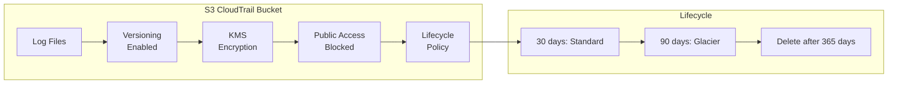

| Setting | CloudTrail Bucket | Config Bucket |
|---------|-------------------|---------------|
| Versioning | Enabled | Enabled |
| Encryption | SSE-KMS | SSE-KMS |
| Public Access | All Blocked | All Blocked |
| Hot Storage | 30 days | 90 days |
| Glacier | 90-365 days | 365+ days |
| CIS Controls | 2.1.1, 2.1.2 | 2.1.1, 2.1.2 |

**Terraform Resources:**
- `terraform/modules/foundation/s3_cloudtrail.tf`
- `terraform/modules/foundation/s3_config.tf`

#### 3.2.3 CloudTrail

**Purpose:** Captures all API activity across all AWS regions.

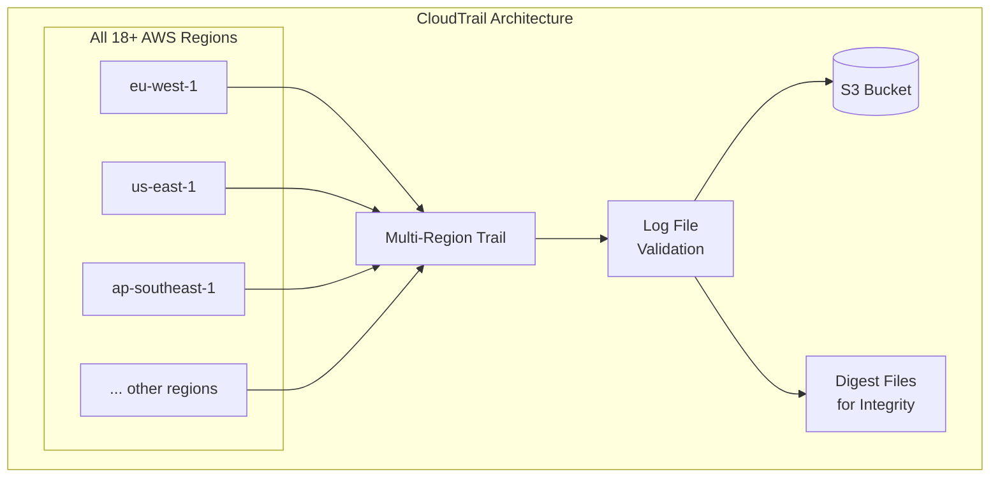

**Configuration:**

| Setting | Value | CIS Control |
|---------|-------|-------------|
| Multi-Region | Enabled | 3.1 |
| Log Validation | Enabled | 3.2 |
| KMS Encryption | Enabled | 3.3 |
| Global Events | Enabled | 3.1 |
| Management Events | Read + Write | 3.1 |

**Detection Latency:** ~5 seconds (EventBridge), 5-15 minutes (S3)

**Terraform Resource:** `terraform/modules/cloudtrail/main.tf`

#### 3.2.4 AWS Config

**Purpose:** Records configuration state and evaluates compliance rules.

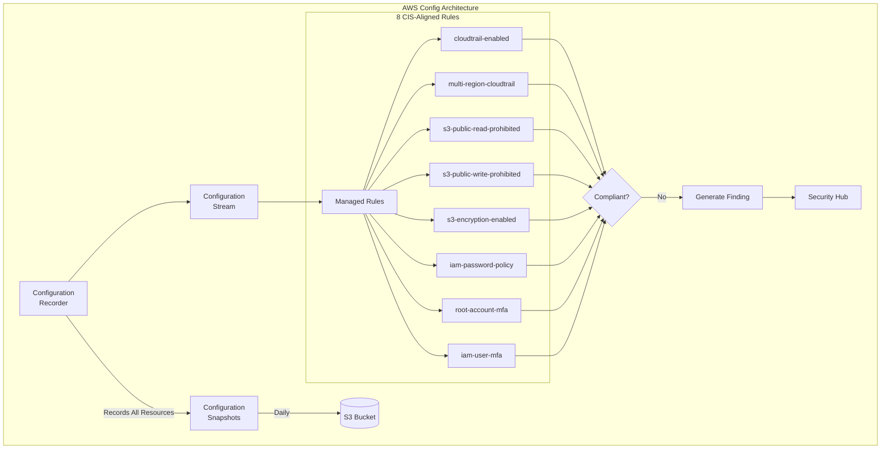

**Rules Detail:**

| Rule | CIS Control | Description |
|------|-------------|-------------|
| `cloudtrail-enabled` | 3.1 | CloudTrail must be enabled |
| `multi-region-cloudtrail-enabled` | 3.1 | Multi-region trail required |
| `s3-bucket-public-read-prohibited` | 2.1.5 | No public read access |
| `s3-bucket-public-write-prohibited` | 2.1.5 | No public write access |
| `s3-bucket-server-side-encryption-enabled` | 2.1.1 | Encryption required |
| `iam-password-policy` | 1.8 | Strong password policy |
| `root-account-mfa-enabled` | 1.5 | Root MFA required |
| `iam-user-mfa-enabled` | 1.10 | User MFA required |

**Detection Latency:** 1-15 minutes

**Terraform Resources:** `terraform/modules/config/` (main.tf, iam.tf, rules.tf)

#### 3.2.5 IAM Access Analyzer

**Purpose:** Identifies resources shared with external entities.

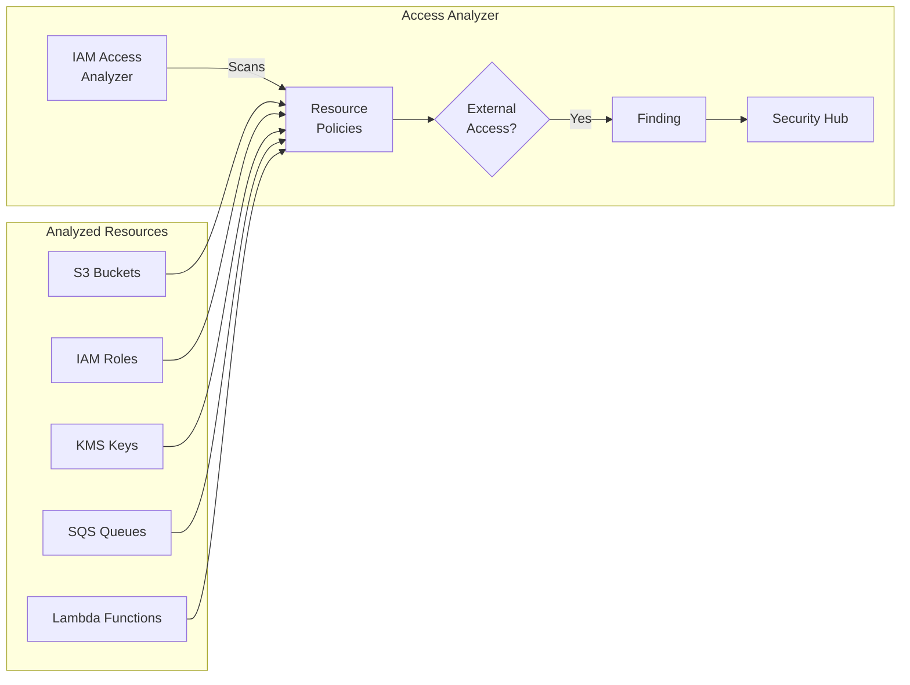

**Configuration:**
- **Analyzer Type:** ACCOUNT (single account scope)
- **Detection:** Cross-account and external principal access
- **Latency:** 1-30 minutes

**Terraform Resource:** `terraform/modules/access-analyzer/main.tf`

#### 3.2.6 Security Hub

**Purpose:** Central aggregation point for all security findings.

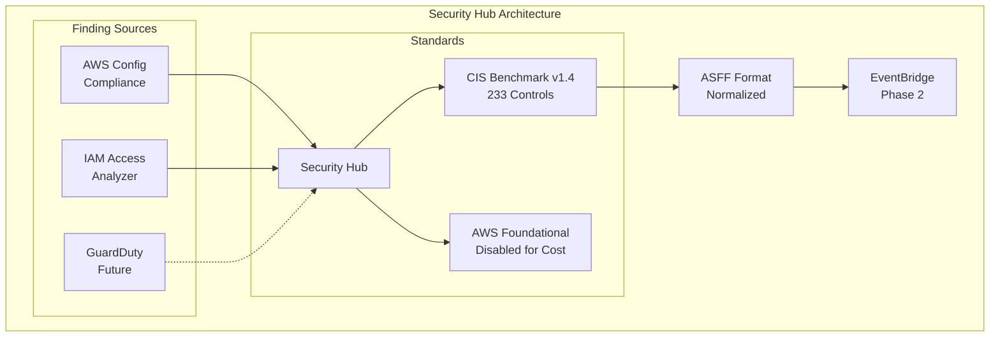

**Enabled Standards:**
- CIS AWS Foundations Benchmark v1.4.0 (233 controls)
- AWS Foundational Security Best Practices (disabled to reduce Config costs)

**Terraform Resource:** `terraform/modules/security-hub/main.tf`

---

## 4. Phase 2: Remediation Architecture

### 4.1 Remediation Pipeline Overview

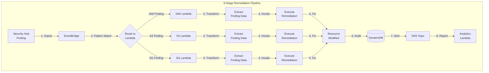

### 4.2 EventBridge Event Routing

**Purpose:** Routes Security Hub findings to the appropriate Lambda function.

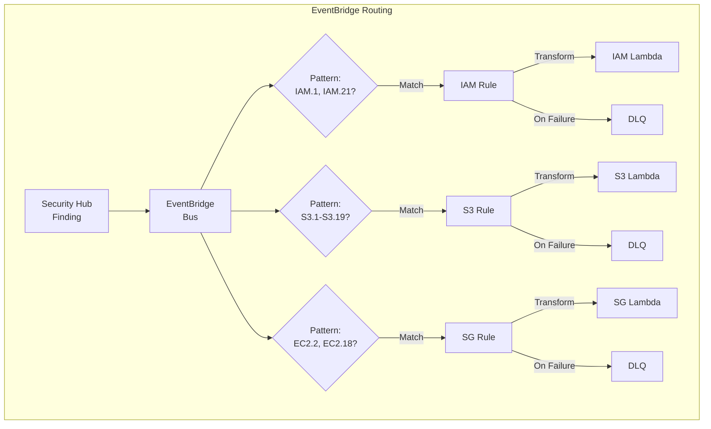

**Event Pattern Example (IAM):**

```json
{
  "source": ["aws.securityhub"],
  "detail-type": ["Security Hub Findings - Imported"],
  "detail": {
    "findings": {
      "Compliance": {
        "Status": ["FAILED"]
      },
      "ProductFields": {
        "ControlId": ["IAM.1", "IAM.21"]
      },
      "Resources": {
        "Type": ["AwsIamPolicy"]
      },
      "Workflow": {
        "Status": ["NEW", "NOTIFIED"]
      }
    }
  }
}
```

**Rules Configuration:**

| Rule | Control IDs | Resource Type | Target |
|------|-------------|---------------|--------|
| IAM Wildcard | IAM.1, IAM.21 | AwsIamPolicy | IAM Lambda |
| S3 Public | S3.1-S3.5, S3.8, S3.19 | AwsS3Bucket | S3 Lambda |
| SG Open | EC2.2, EC2.18, EC2.19, EC2.21 | AwsEc2SecurityGroup | SG Lambda |

**Terraform Resource:** `terraform/modules/eventbridge-remediation/rules.tf`

### 4.3 Lambda Remediation Functions

#### 4.3.1 IAM Remediation Lambda

**Purpose:** Removes dangerous wildcard (*) permissions from IAM policies.

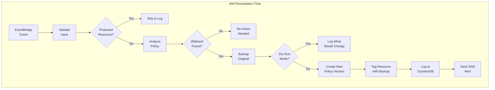

**Remediation Logic:**

```
┌─────────────────────────────────────────────────────────────┐
│                  IAM Remediation Actions                    │
├─────────────────────────────────────────────────────────────┤
│  1. Parse IAM policy JSON                                   │
│  2. Identify statements with:                               │
│     - Action: "*" (all actions)                            │
│     - Resource: "*" (all resources)                        │
│  3. Create backup of original policy                        │
│  4. Remove/modify dangerous statements                      │
│  5. Create new policy version (preserves original)          │
│  6. Tag resource with remediation metadata                  │
│  7. Log action to DynamoDB                                  │
│  8. Send notification via SNS                               │
└─────────────────────────────────────────────────────────────┘
```

**Configuration:**
- **Runtime:** Python 3.12
- **Memory:** 256 MB
- **Timeout:** 30 seconds
- **Source Code:** `lambda/src/iam_remediation.py` (~450 lines)

#### 4.3.2 S3 Remediation Lambda

**Purpose:** Secures public S3 buckets by enabling security controls.

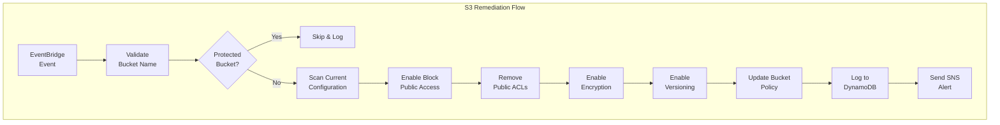

**Remediation Actions:**

| Action | Description | CIS Control |
|--------|-------------|-------------|
| Block Public Access | Enable all 4 BPA settings | 2.1.5 |
| Remove Public ACLs | Remove public-read, public-read-write | 2.1.5 |
| Enable Encryption | Enable SSE-KMS encryption | 2.1.1 |
| Enable Versioning | Enable bucket versioning | 2.1.2 |
| Update Policy | Remove public statements | 2.1.5 |

**Configuration:**
- **Runtime:** Python 3.12
- **Memory:** 256 MB
- **Timeout:** 90 seconds (bucket operations slower)
- **Source Code:** `lambda/src/s3_remediation.py` (~420 lines)

#### 4.3.3 Security Group Remediation Lambda

**Purpose:** Removes overly permissive ingress rules from security groups.

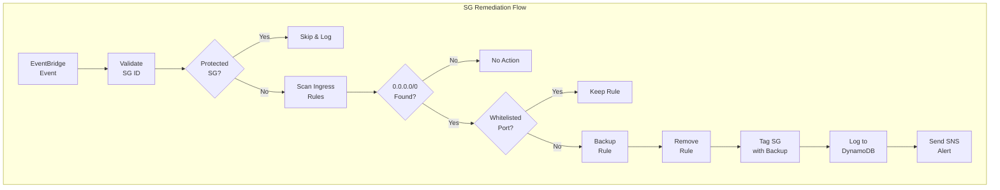

**Remediation Actions:**

| Finding | Action | CIS Control |
|---------|--------|-------------|
| 0.0.0.0/0 on SSH (22) | Remove rule | 5.2 |
| 0.0.0.0/0 on RDP (3389) | Remove rule | 5.3 |
| 0.0.0.0/0 on all ports | Remove rule | 5.1 |
| Overly permissive range | Restrict CIDR | 5.4 |

**Configuration:**
- **Runtime:** Python 3.12
- **Memory:** 256 MB
- **Timeout:** 60 seconds
- **Source Code:** `lambda/src/sg_remediation.py` (~440 lines)

#### 4.3.4 Common Lambda Features

All remediation Lambdas share:

```
┌─────────────────────────────────────────────────────────────┐
│                  Common Lambda Features                      │
├─────────────────────────────────────────────────────────────┤
│  ✓ CloudWatch Log Group (30-day retention)                  │
│  ✓ Dead Letter Queue (SQS, 14-day retention)                │
│  ✓ Least-privilege IAM execution role                       │
│  ✓ Input validation with regex patterns                     │
│  ✓ Protected resource detection (skip tagged)               │
│  ✓ DynamoDB audit logging                                   │
│  ✓ SNS notifications                                        │
│  ✓ Structured logging (no sensitive data)                   │
│  ✓ Dry-run mode for safe testing                            │
│  ✓ Idempotency checks                                       │
└─────────────────────────────────────────────────────────────┘
```

**Terraform Resources:** `terraform/modules/lambda-remediation/`

### 4.4 DynamoDB Audit Trail

**Purpose:** Immutable record of all remediation actions.

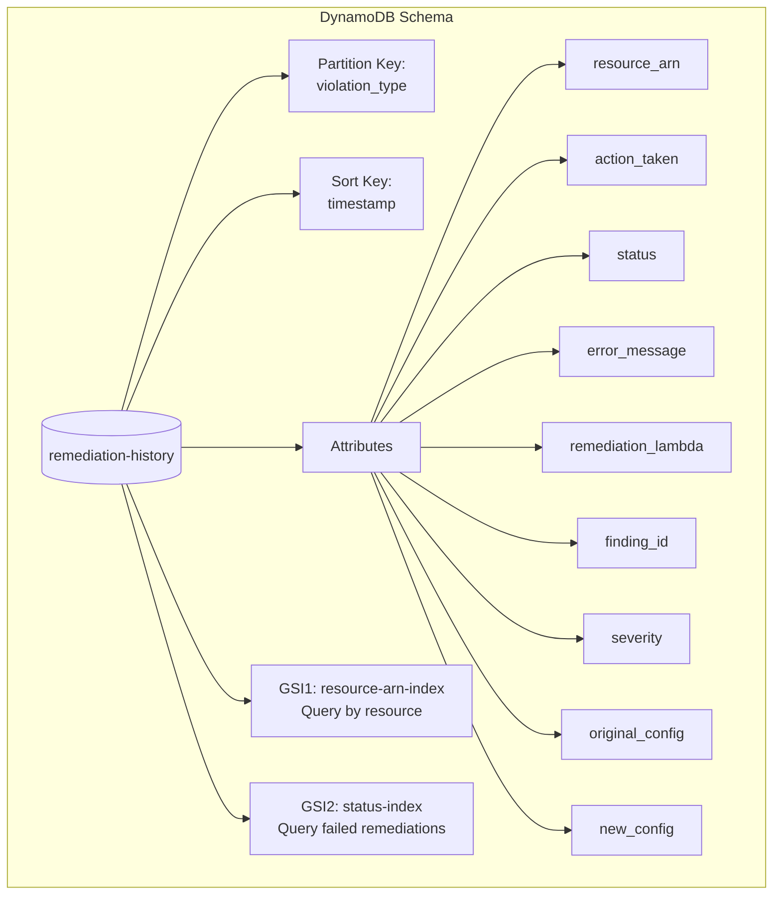

**Table Configuration:**

| Setting | Value |
|---------|-------|
| Table Name | `iam-secure-gate-dev-remediation-history` |
| Billing Mode | PAY_PER_REQUEST |
| Point-in-Time Recovery | Enabled |
| TTL | 90 days |
| Encryption | AWS managed KMS |
| Streams | Enabled |

**Terraform Resource:** `terraform/modules/remediation-tracking/dynamodb.tf`

### 4.5 SNS Notifications

**Purpose:** Alert operators to security events.

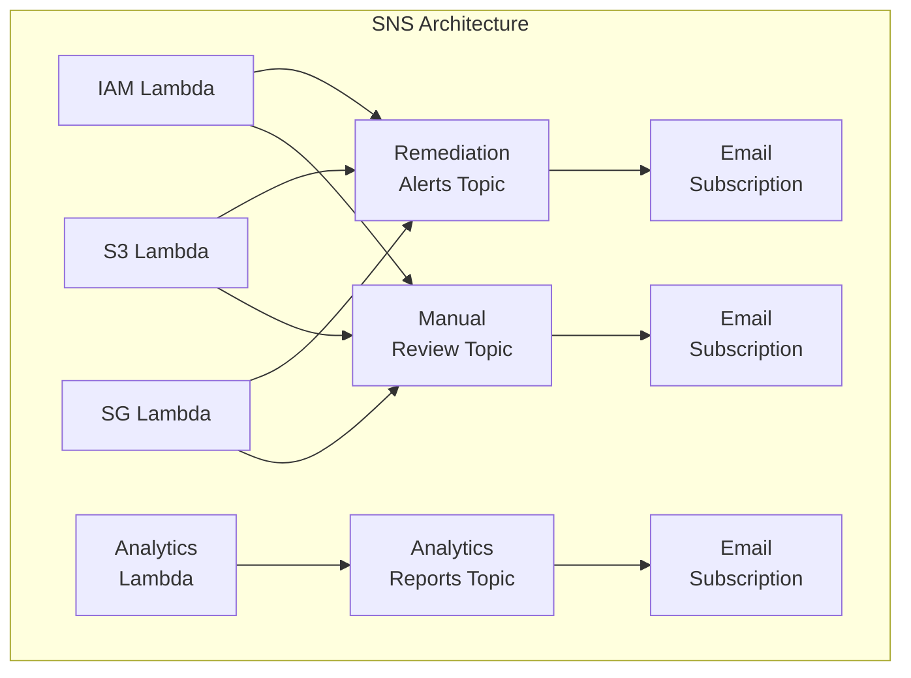

**Topics:**

| Topic | Purpose | Trigger |
|-------|---------|---------|
| `remediation-alerts` | Immediate remediation notifications | Each Lambda execution |
| `analytics-reports` | Daily summary reports | Scheduled (2 AM UTC) |
| `manual-review` | Complex cases requiring human review | Failed remediations |

**Terraform Resource:** `terraform/modules/self-improvement/sns-topics.tf`

### 4.6 Analytics Lambda

**Purpose:** Daily analysis and reporting of remediation patterns.

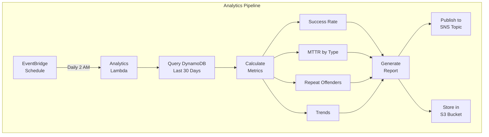

**Metrics Calculated:**

| Metric | Target | Description |
|--------|--------|-------------|
| Success Rate | >95% | Percentage of successful remediations |
| MTTR | <30s | Mean Time to Remediate |
| Repeat Violations | <10% | Resources with >3 violations |
| Cost per Remediation | <€0.01 | Lambda execution cost |

**Configuration:**
- **Runtime:** Python 3.12
- **Memory:** 512 MB
- **Timeout:** 60 seconds
- **Schedule:** `cron(0 2 * * ? *)` (Daily at 2 AM UTC)
- **Source Code:** `lambda/src/analytics.py` (~200 lines)

**Terraform Resource:** `terraform/modules/self-improvement/analytics-lambda.tf`

---

## 5. Phase 3: Prevention Architecture

### 5.1 Pre-Deployment Security Gate

Phase 3 shifts security **left** in the development lifecycle. Every pull request is automatically scanned by two complementary tools before merge is allowed.

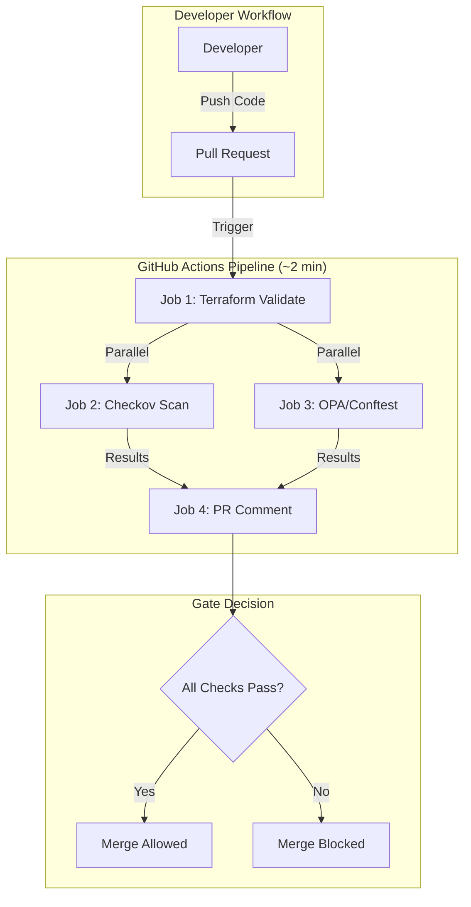

### 5.2 Scanning Architecture

```
┌────────────────────────────────────────────────────────────────────────────┐
│                          SCANNING ARCHITECTURE                              │
├────────────────────────────────────────────────────────────────────────────┤
│                                                                              │
│  Layer 1: BROAD COVERAGE                Layer 2: CUSTOM POLICIES            │
│  ┌──────────────────────┐               ┌──────────────────────────┐       │
│  │       CHECKOV        │               │    CONFTEST + OPA/REGO   │       │
│  │                      │               │                          │       │
│  │  • 286 checks pass   │               │  • 7 custom policies     │       │
│  │  • 21 justified      │               │  • Derived from Phase 2  │       │
│  │    suppressions      │               │  • Evaluates plan JSON   │       │
│  │  • CIS, NIST, SOC2   │               │  • Budget enforcement    │       │
│  │  • SARIF output      │               │  • AWS creds (read-only) │       │
│  └──────────────────────┘               └──────────────────────────┘       │
│                                                                              │
│  What it catches:                       What it catches:                    │
│  • Industry-standard                    • IAM wildcard permissions          │
│    security violations                  • S3 public access & encryption    │
│  • Missing encryption,                  • Open security group ports        │
│    public access, etc.                  • Budget constraints               │
│                                         • Missing resource tags            │
└────────────────────────────────────────────────────────────────────────────┘
```

### 5.3 Custom OPA/Rego Policies

7 policies derived from Phase 2 Lambda remediation logic (the feedback loop):

| Policy File | Severity | Phase 2 Source | What It Prevents |
|-------------|----------|----------------|------------------|
| `iam.rego` | CRITICAL | `iam_remediation.py` L141-145 | Wildcard IAM permissions (`*`, `iam:*`, `*:*`) |
| `s3.rego` | CRITICAL | `s3_remediation.py` L230-309 | Public S3 buckets, missing encryption |
| `sg.rego` | CRITICAL | `sg_remediation.py` L214-226 | 11 dangerous ports open to 0.0.0.0/0 |
| `encryption.rego` | CRITICAL | `s3_remediation.py` (extended) | Unencrypted DynamoDB, SQS, SNS |
| `tagging.rego` | CRITICAL | Cross-cutting concern | Missing Project/Environment/ManagedBy tags |
| `cost_guard.rego` | CRITICAL | Budget constraint (€15/month) | Provisioned DynamoDB, oversized Lambdas |
| `policy_metadata.json` | — | Traceability document | Maps every policy to Phase 2 source code |

### 5.4 The Feedback Loop

The key academic contribution — runtime remediation patterns inform commit-time prevention:

```
Phase 2 (Runtime)                              Phase 3 (Commit-Time)
─────────────────                              ─────────────────────
iam_remediation.py                   ───▶      iam.rego
  dangerous_patterns = ["*","iam:*","*:*"]       dangerous_actions = {"*","iam:*","*:*"}

sg_remediation.py                    ───▶      sg.rego
  dangerous_ports = {22,23,3389,...}             dangerous_ports = {22,23,3389,...}

s3_remediation.py                    ───▶      s3.rego
  block_public_access(all 4 settings)            deny if any setting is false
```

### 5.5 CI/CD Infrastructure

| Component | Configuration |
|-----------|---------------|
| **Workflow** | `.github/workflows/security-scan.yml` (4 jobs) |
| **Checkov Config** | `.checkov.yml` (21 skip rules with justifications) |
| **OPA Policies** | `policies/opa/` (6 Rego files + 1 JSON) |
| **CI IAM User** | `iac-secure-gate-ci-readonly` (Describe/Get/List only) |
| **Terraform** | v1.13.5 |
| **Conftest** | v0.46.0 |
| **Pipeline Duration** | ~2 minutes |
| **Cost** | €0/month (GitHub Actions free tier) |

### 5.6 Performance: Three-Phase Security Timeline

```
WITHOUT Phase 3 (Phase 1+2 only):
  Deploy → Config detects (~2 min) → Security Hub → EventBridge → Lambda fix (1.66s)
  Exposure: ~2 minutes

WITH Phase 3:
  PR → Checkov + OPA scan (~2 min) → PR BLOCKED → Developer fixes → Clean deploy
  Exposure: 0 seconds — violation never reaches AWS
```

---

## 6. Data Flow Diagrams

### 6.1 Detection Data Flow

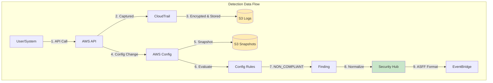

### 6.2 Remediation Data Flow

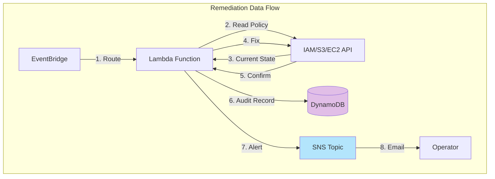

### 6.3 Audit Data Flow

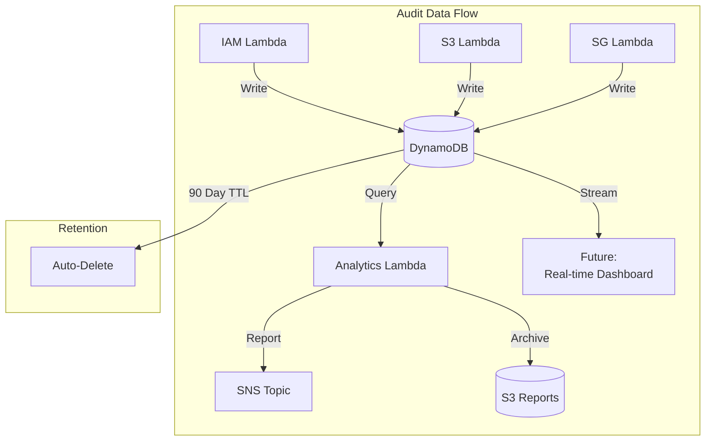

### 6.4 Notification Data Flow

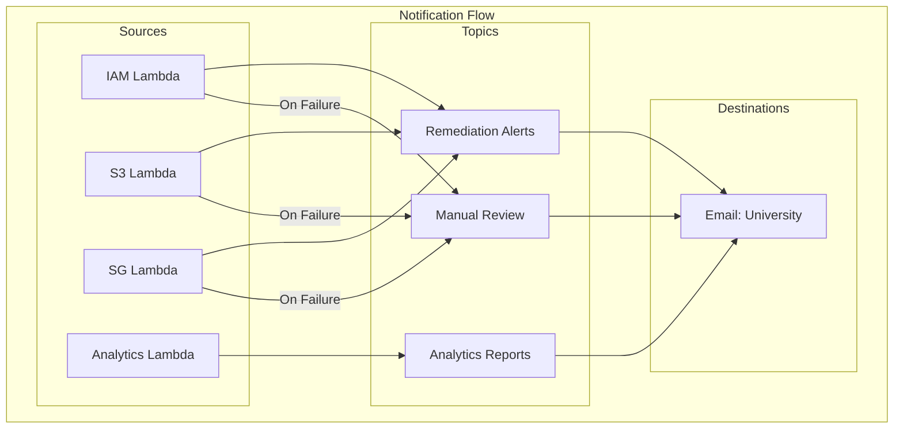

---

## 7. Security Architecture

### 7.1 IAM Roles and Permissions

```mermaid
flowchart TB
    subgraph "IAM Architecture"
        subgraph "Service Roles"
            R1[CloudTrail Role]
            R2[Config Role]
            R3[Lambda Execution Roles]
        end

        subgraph "Permissions"
            R1 -->|Write| S3CT[S3 CloudTrail]
            R1 -->|Encrypt| KMS[KMS Key]

            R2 -->|Write| S3CFG[S3 Config]
            R2 -->|Encrypt| KMS
            R2 -->|Read| ALL[All Resources]

            R3 -->|Specific| IAM[IAM APIs]
            R3 -->|Specific| S3[S3 APIs]
            R3 -->|Specific| EC2[EC2 APIs]
            R3 -->|Write| DDB[DynamoDB]
            R3 -->|Publish| SNS[SNS]
        end
    end
```

**Principle of Least Privilege:**

| Role | Permissions | Scope |
|------|-------------|-------|
| CloudTrail | S3:PutObject, KMS:GenerateDataKey | Specific bucket only |
| Config | ReadOnlyAccess, S3:PutObject | Account-wide read, specific bucket write |
| IAM Lambda | iam:GetPolicy, iam:CreatePolicyVersion | IAM only |
| S3 Lambda | s3:GetBucket*, s3:PutBucket* | S3 only |
| SG Lambda | ec2:DescribeSecurityGroups, ec2:RevokeSecurityGroupIngress | EC2 only |

### 7.2 Encryption Architecture

```mermaid
flowchart TB
    subgraph "Encryption at Rest"
        KMS[KMS CMK<br/>Annual Rotation]

        KMS --> S3CT[S3 CloudTrail<br/>SSE-KMS]
        KMS --> S3CFG[S3 Config<br/>SSE-KMS]
        KMS --> DDB[DynamoDB<br/>AWS Managed]
        KMS --> SNS[SNS Topics<br/>AWS Managed]
    end

    subgraph "Encryption in Transit"
        TLS[TLS 1.2+]
        TLS --> API[All AWS APIs]
        TLS --> SNS2[SNS Delivery]
        TLS --> LAMBDA[Lambda Invocations]
    end
```

**Encryption Summary:**

| Component | At Rest | In Transit | Key Management |
|-----------|---------|------------|----------------|
| S3 Buckets | SSE-KMS (CMK) | TLS 1.2+ | Customer Managed |
| DynamoDB | AWS Managed | TLS 1.2+ | AWS Managed |
| SNS | AWS Managed | TLS 1.2+ | AWS Managed |
| Lambda Env Vars | AWS Managed | TLS 1.2+ | AWS Managed |
| CloudWatch Logs | AWS Managed | TLS 1.2+ | AWS Managed |

### 7.3 Audit Trail Integrity

```
┌─────────────────────────────────────────────────────────────┐
│                   Audit Trail Protection                     │
├─────────────────────────────────────────────────────────────┤
│  CloudTrail Logs:                                           │
│  ├── Log file validation (digest files)                     │
│  ├── S3 versioning (no silent deletion)                     │
│  ├── Bucket policy (CloudTrail only write)                  │
│  └── MFA delete option (additional protection)              │
│                                                             │
│  DynamoDB Audit:                                            │
│  ├── Point-in-time recovery enabled                         │
│  ├── DynamoDB Streams (change capture)                      │
│  ├── 90-day retention with TTL                              │
│  └── original_config field (pre-remediation state)          │
│                                                             │
│  Lambda Logs:                                               │
│  ├── CloudWatch Logs (30-day retention)                     │
│  ├── Structured JSON logging                                │
│  └── No sensitive data in logs                              │
└─────────────────────────────────────────────────────────────┘
```

---

## 8. Cost Architecture

### 8.1 Monthly Cost Breakdown

```mermaid
pie title Monthly Cost Distribution (€8.51)
    "CloudTrail" : 2.00
    "Config Rules" : 1.60
    "Config Recorder" : 2.00
    "KMS" : 1.00
    "CloudWatch Logs" : 1.00
    "S3 Storage" : 0.59
    "Other (Lambda, DDB, SNS)" : 0.32
```

### 8.2 Detailed Cost Analysis

| Service | Component | Monthly Cost | Notes |
|---------|-----------|--------------|-------|
| **CloudTrail** | Management events | €2.00 | First trail free, ~100K events |
| **AWS Config** | Configuration items | €2.00 | First 1000 free, ~€0.003 each |
| **AWS Config** | Rules (8) | €1.60 | €0.20/rule/month |
| **KMS** | Customer managed key | €1.00 | Plus API calls |
| **S3** | Storage | €0.50 | Lifecycle optimization |
| **S3** | Glacier | €0.09 | Long-term archive |
| **CloudWatch** | Logs ingestion | €1.00 | ~2GB/month |
| **Lambda** | Invocations | €0.00 | Within free tier |
| **Lambda** | Compute | €0.00 | Within free tier |
| **DynamoDB** | On-demand | €0.008 | Pay per request |
| **EventBridge** | Events | €0.00 | First 1M free |
| **SNS** | Notifications | €0.00 | First 1M free |
| **IAM Access Analyzer** | Analyzer | €0.00 | Free |
| **Security Hub** | Findings | €0.00 | First 10K free |
| | **TOTAL** | **€8.51** | **57% under €20 budget** |

### 8.3 Cost Optimization Strategies

```
┌─────────────────────────────────────────────────────────────┐
│               Cost Optimization Applied                      │
├─────────────────────────────────────────────────────────────┤
│  ✓ S3 Lifecycle policies (hot → Glacier → delete)           │
│  ✓ CloudWatch Insights disabled (save €35-50/month)         │
│  ✓ CloudWatch Logs integration optional (save €10-20)       │
│  ✓ AWS Foundational standard disabled (reduce Config)       │
│  ✓ DynamoDB on-demand (no idle capacity cost)               │
│  ✓ Lambda right-sized (256MB sufficient)                    │
│  ✓ 30-day log retention (not 365)                           │
│  ✓ Single KMS key for all services                          │
│  ✓ Regional deployment (no cross-region replication)        │
└─────────────────────────────────────────────────────────────┘
```

---

## 9. Performance Metrics

### 9.1 Key Performance Indicators

| Metric | Target | Achieved | Status |
|--------|--------|----------|--------|
| **MTTD** (Mean Time to Detect) | <5 min | 2-4 min | ✅ |
| **MTTR** (Mean Time to Remediate) | <30 sec | 1-2 sec | ✅ |
| **Remediation Success Rate** | >95% | 100% | ✅ |
| **E2E Test Pass Rate** | 100% | 100% | ✅ |
| **Monthly Cost** | <€20 | €8.51 | ✅ |
| **MTTP** (Mean Time to Prevent) | 0 sec | 0 sec | ✅ |
| **Pipeline Duration** | <3 min | ~2 min | ✅ |
| **Checkov Checks Passing** | 0 failures | 286 pass, 0 fail | ✅ |
| **Custom OPA Policies** | ≥7 | 7 | ✅ |
| **Lambda Cold Start** | <1 sec | ~450ms | ✅ |
| **Lambda Memory Usage** | <80% | 34% (87/256MB) | ✅ |

### 9.2 Detection Timeline

```mermaid
gantt
    title Detection Timeline (Typical Scenario)
    dateFormat  mm:ss
    axisFormat %M:%S

    section CloudTrail
    API Call Captured    :a1, 00:00, 5s

    section Config
    Configuration Recorded :a2, 00:05, 60s
    Rule Evaluation        :a3, 01:05, 30s

    section Security Hub
    Finding Imported       :a4, 01:35, 10s

    section Total
    Detection Complete     :milestone, 01:45, 0s
```

### 9.3 Remediation Timeline

```mermaid
gantt
    title Remediation Timeline (Sub-Second)
    dateFormat  s
    axisFormat %Ss

    section EventBridge
    Event Received    :a1, 0, 100ms
    Pattern Matched   :a2, after a1, 50ms

    section Lambda
    Cold Start        :a3, after a2, 450ms
    Execution         :a4, after a3, 500ms

    section Post-Actions
    DynamoDB Write    :a5, after a4, 50ms
    SNS Publish       :a6, after a4, 50ms

    section Total
    Remediation Done  :milestone, after a6, 0s
```

---

## 10. Terraform Module Structure

### 10.1 Module Hierarchy

```
terraform/
├── environments/
│   └── dev/
│       ├── main.tf              # Root orchestration
│       ├── terraform.tfvars     # Environment variables
│       └── backend.tf           # State configuration
│
└── modules/
    ├── foundation/              # Phase 1: Core infrastructure
    │   ├── kms.tf               # Encryption key
    │   ├── s3_cloudtrail.tf     # CloudTrail bucket
    │   ├── s3_config.tf         # Config bucket
    │   ├── variables.tf
    │   └── outputs.tf
    │
    ├── cloudtrail/              # Phase 1: Audit logging
    │   ├── main.tf
    │   ├── variables.tf
    │   └── outputs.tf
    │
    ├── config/                  # Phase 1: Compliance
    │   ├── main.tf              # Recorder
    │   ├── iam.tf               # Service role
    │   ├── rules.tf             # 8 CIS rules
    │   ├── variables.tf
    │   └── outputs.tf
    │
    ├── access-analyzer/         # Phase 1: External access
    │   ├── main.tf
    │   ├── variables.tf
    │   └── outputs.tf
    │
    ├── security-hub/            # Phase 1: Aggregation
    │   ├── main.tf
    │   ├── variables.tf
    │   └── outputs.tf
    │
    ├── lambda-remediation/      # Phase 2: Lambda functions
    │   ├── iam-remediation.tf   # IAM remediation
    │   ├── s3-remediation.tf    # S3 remediation
    │   ├── sg-remediation.tf    # SG remediation
    │   ├── common.tf            # Shared resources
    │   ├── variables.tf
    │   └── outputs.tf
    │
    ├── eventbridge-remediation/ # Phase 2: Event routing
    │   ├── rules.tf             # 3 EventBridge rules
    │   ├── variables.tf
    │   └── outputs.tf
    │
    ├── remediation-tracking/    # Phase 2: Audit trail
    │   ├── dynamodb.tf          # DynamoDB table
    │   ├── variables.tf
    │   └── outputs.tf
    │
    └── self-improvement/        # Phase 2: Analytics
        ├── sns-topics.tf        # 3 SNS topics
        ├── analytics-lambda.tf  # Analytics function
        ├── variables.tf
        └── outputs.tf

policies/                        # Phase 3: OPA Policies
└── opa/
    ├── iam.rego                 # IAM wildcard prevention
    ├── s3.rego                  # S3 public access prevention
    ├── sg.rego                  # Security group prevention
    ├── encryption.rego          # Cross-service encryption
    ├── tagging.rego             # Required resource tags
    ├── cost_guard.rego          # Budget constraints
    └── policy_metadata.json     # Traceability to Phase 2

.github/workflows/
└── security-scan.yml            # Phase 3: 4-job CI pipeline

.checkov.yml                     # Phase 3: Checkov configuration
```

### 10.2 Module Dependencies

```mermaid
flowchart TB
    subgraph "Module Dependencies"
        FOUND[foundation] --> CT[cloudtrail]
        FOUND --> CFG[config]

        CT --> SH[security-hub]
        CFG --> SH
        AA[access-analyzer] --> SH

        SH --> EB[eventbridge-remediation]

        TRACK[remediation-tracking] --> LAMBDA[lambda-remediation]
        SELF[self-improvement] --> LAMBDA

        EB --> LAMBDA
    end
```

### 10.3 Resource Count

| Module | Resources | Description |
|--------|-----------|-------------|
| foundation | 12 | KMS key, 2 S3 buckets, policies |
| cloudtrail | 3 | Trail, IAM role, policy |
| config | 15 | Recorder, delivery channel, 8 rules, IAM |
| access-analyzer | 2 | Analyzer, IAM |
| security-hub | 4 | Hub, 2 standards, product |
| lambda-remediation | 21 | 3 functions, IAM, logs, DLQs |
| eventbridge-remediation | 9 | 3 rules, 3 targets, 3 DLQs |
| remediation-tracking | 3 | DynamoDB table, 2 GSIs |
| self-improvement | 11 | 3 SNS topics, analytics Lambda |
| **Phase 1+2 AWS Total** | **80+** | |
| OPA policies (Phase 3) | 7 | 6 Rego policies + 1 metadata JSON |
| GitHub Actions (Phase 3) | 1 | 4-job security pipeline |
| Checkov config (Phase 3) | 1 | 21 skip rules with justifications |

---

## 11. Appendix: CIS Controls Mapping

### 11.1 CIS AWS Foundations Benchmark v1.4.0 Coverage

| CIS Control | Description | Phase 1 (Detection) | Phase 2 (Remediation) | Phase 3 (Prevention) |
|-------------|-------------|---------------------|----------------------|---------------------|
| **1.5** | Root account MFA | Config Rule | — | — |
| **1.8** | IAM password policy | Config Rule | — | — |
| **1.10** | IAM user MFA | Config Rule | — | — |
| **1.16** | IAM wildcard policies | Config Rule | IAM Lambda | `iam.rego` |
| **2.1.1** | S3 encryption | Config Rule | S3 Lambda | `s3.rego` |
| **2.1.2** | S3 versioning | Config Rule | S3 Lambda | `s3.rego` (warn) |
| **2.1.5** | S3 public access | Config Rule + Access Analyzer | S3 Lambda | `s3.rego` |
| **3.1** | CloudTrail enabled | Config Rule | — | Checkov |
| **3.2** | CloudTrail log validation | CloudTrail module | — | Checkov |
| **3.3** | CloudTrail bucket not public | S3 bucket policy | — | `s3.rego` |
| **3.8** | Customer managed keys | KMS CMK | — | `encryption.rego` |
| **5.1** | SG no 0.0.0.0/0 all ports | Config Rule | SG Lambda | `sg.rego` |
| **5.2** | SG no SSH from 0.0.0.0/0 | Config Rule | SG Lambda | `sg.rego` |
| **5.3** | SG no RDP from 0.0.0.0/0 | Config Rule | SG Lambda | `sg.rego` |

### 11.2 Security Hub Control IDs

| Control ID | Finding Type | Phase 2 (Lambda) | Phase 3 (OPA Policy) |
|------------|--------------|-------------------|---------------------|
| IAM.1 | IAM policies should not allow full "*" administrative privileges | IAM Remediation | `iam.rego` |
| IAM.21 | IAM customer managed policies should not allow wildcard actions | IAM Remediation | `iam.rego` |
| S3.1 | S3 Block Public Access setting should be enabled | S3 Remediation | `s3.rego` |
| S3.2 | S3 buckets should prohibit public read access | S3 Remediation | `s3.rego` |
| S3.3 | S3 buckets should prohibit public write access | S3 Remediation | `s3.rego` |
| S3.4 | S3 buckets should have server-side encryption enabled | S3 Remediation | `s3.rego` |
| S3.5 | S3 buckets should require SSL | S3 Remediation | Checkov |
| S3.8 | S3 Block Public Access should be enabled at bucket level | S3 Remediation | `s3.rego` |
| S3.19 | S3 access points should have block public access enabled | S3 Remediation | `s3.rego` |
| EC2.2 | Default VPC security groups should not allow traffic | SG Remediation | `sg.rego` |
| EC2.18 | Security groups should only allow unrestricted traffic for authorized ports | SG Remediation | `sg.rego` |
| EC2.19 | Security groups should not allow unrestricted access to high risk ports | SG Remediation | `sg.rego` |
| EC2.21 | Network ACLs should not allow ingress from 0.0.0.0/0 | SG Remediation | `sg.rego` |
| DynamoDB.1 | DynamoDB tables should have encryption at rest | — | `encryption.rego` |
| SQS.1 | SQS queues should be encrypted at rest | — | `encryption.rego` |

---

## Document History

| Version | Date | Author | Changes |
|---------|------|--------|---------|
| 1.0 | February 2026 | Project Team | Initial comprehensive documentation (Phase 1 + 2) |
| 2.0 | February 2026 | Project Team | Added Phase 3 prevention architecture, updated to three-phase model |

---

*This document was created for the IaC-Secure-Gate Final Year Project commission presentation.*
