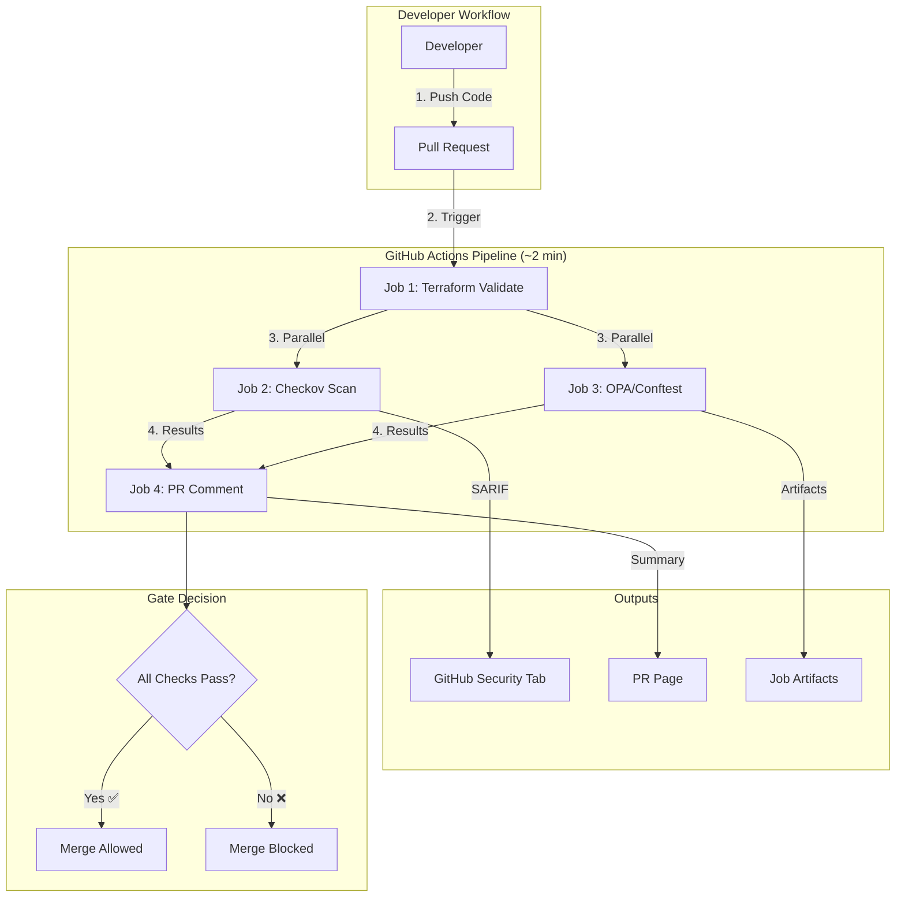
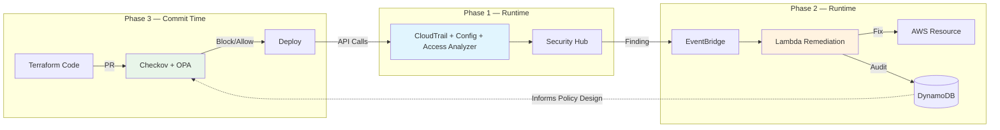

# Phase 3: IaC Security Gate — Pre-Deployment Security Scanning

## Project: IaC-Secure-Gate
**Duration:** Weeks 9-12 (4 weeks)
**Status:** Planning
**Previous Phase:** Phase 2 - Automated Remediation (Complete)
**Last Updated:** February 2026

---

## Table of Contents
1. [Executive Summary](#executive-summary)
2. [Phase Objectives](#phase-objectives)
3. [Architecture Overview](#architecture-overview)
4. [The Feedback Loop — Key Academic Contribution](#the-feedback-loop--key-academic-contribution)
5. [Tool Selection](#tool-selection)
6. [GitHub Actions Pipeline](#github-actions-pipeline)
7. [Custom OPA/Rego Policies](#custom-oparego-policies)
8. [Security Hub Control Mapping](#security-hub-control-mapping)
9. [Implementation Plan](#implementation-plan)
10. [Cost Analysis](#cost-analysis)
11. [Success Metrics](#success-metrics)
12. [Challenges & Mitigations](#challenges--mitigations)

---

## Executive Summary

Phase 3 shifts security **left** in the development lifecycle. While Phases 1 and 2 detect and remediate misconfigurations **after** deployment, Phase 3 **prevents** them from being deployed in the first place. Every pull request is automatically scanned for security violations using two complementary tools: Checkov (1,000+ built-in checks) and custom OPA/Rego policies derived directly from Phase 2 runtime remediation data.

**Key Deliverables:**
- GitHub Actions CI/CD pipeline with automated security scanning
- Checkov integration with SARIF output for GitHub Security tab
- 7 custom OPA/Rego policies mirroring Phase 2 Lambda remediation logic
- PR blocking on critical security violations
- Branch protection enforcing required security checks
- Complete traceability between runtime violations and commit-time policies

**Budget Impact:** €0/month — runs entirely on GitHub Actions free tier

---

## Phase Objectives

### Primary Objective

Implement a pre-deployment security gate that scans Terraform infrastructure code in pull requests and blocks merges when critical security violations are detected, using both industry-standard scanning (Checkov) and custom policies derived from Phase 2 runtime remediation data.

### Acceptance Criteria

| ID | Criterion | Target | Priority |
|----|-----------|--------|----------|
| AC1 | PR scan duration | < 3 minutes | P0 |
| AC2 | Critical violation block rate | 100% | P0 |
| AC3 | Custom OPA policies | ≥ 7 policies | P0 |
| AC4 | SARIF GitHub Security tab integration | Findings visible | P1 |
| AC5 | PR comment with scan summary | Auto-posted | P1 |
| AC6 | Phase 2 → Phase 3 traceability | Documented for every policy | P0 |
| AC7 | Monthly cost increase | €0 | P0 |

---

## Architecture Overview

### Three-Phase Security Model

```
╔═══════════════════════════════════════════════════════════════════════════════╗
║                    IaC-Secure-Gate: Defense in Depth                          ║
╠═══════════════════════════════════════════════════════════════════════════════╣
║                                                                               ║
║  ┌─────────────────────────────────────────────────────────────────────────┐  ║
║  │                    PHASE 3: PREVENTION                                  │  ║
║  │                    (Pre-Deployment Gate)                                │  ║
║  │                                                                         │  ║
║  │    Developer writes Terraform code                                      │  ║
║  │         │                                                               │  ║
║  │         ▼                                                               │  ║
║  │    Opens Pull Request                                                   │  ║
║  │         │                                                               │  ║
║  │    ┌────┴────┐     ┌────────────┐     ┌─────────────────┐              │  ║
║  │    │ Checkov │     │ OPA/Rego   │     │ PR Comment      │              │  ║
║  │    │ (1000+  │     │ (7 Custom  │     │ (Summary with   │              │  ║
║  │    │ checks) │     │  Policies) │     │  pass/fail)     │              │  ║
║  │    └────┬────┘     └─────┬──────┘     └────────┬────────┘              │  ║
║  │         │                │                     │                        │  ║
║  │         ▼                ▼                     ▼                        │  ║
║  │    ┌──────────────────────────────────────────────┐                     │  ║
║  │    │  CRITICAL found?  YES → ❌ PR BLOCKED        │                     │  ║
║  │    │                   NO  → ✅ PR APPROVED       │                     │  ║
║  │    └──────────────────────────────────────────────┘                     │  ║
║  │         │                                                               │  ║
║  │         ▼                                                               │  ║
║  └────── MERGE ────────────────────────────────────────────────────────────┘  ║
║            │                                                                  ║
║            ▼                                                                  ║
║  ┌─────────────────────┐           ┌──────────────────────────────────────┐  ║
║  │  PHASE 1: DETECTION │           │  PHASE 2: REMEDIATION               │  ║
║  │  (Runtime Monitoring)│           │  (Automated Response)               │  ║
║  │                     │           │                                      │  ║
║  │  CloudTrail ──────┐ │           │  EventBridge ──▶ Lambda ──▶ Fix     │  ║
║  │  AWS Config ──────┼─┼──▶ Security Hub ──┘     │  │                    │  ║
║  │  Access Analyzer ─┘ │           │  DynamoDB ◄──── Audit ──▶ SNS      │  ║
║  │                     │           │                                      │  ║
║  │  MTTD: 4 seconds   │           │  MTTR: 1.66 seconds                 │  ║
║  └─────────────────────┘           └──────────────────────────────────────┘  ║
║                                                                               ║
╚═══════════════════════════════════════════════════════════════════════════════╝
```

### Phase 3 Pipeline Detail



### Where Phase 3 Fits in the Data Flow



---

## The Feedback Loop — Key Academic Contribution

This is what elevates Phase 3 from "tool integration" to "policy engineering with original contribution." The custom OPA policies are not generic — they are **derived directly from Phase 2 runtime remediation data**.

### The Principle

```
┌─────────────────────────────────────┐         ┌──────────────────────────────────┐
│       PHASE 2: Runtime              │         │       PHASE 3: Commit-Time       │
│       (Learns what goes wrong)      │         │       (Prevents it happening)    │
├─────────────────────────────────────┤         ├──────────────────────────────────┤
│                                     │         │                                  │
│  iam_remediation.py                 │ Informs │  iam.rego                        │
│  ─────────────────                  │───────▶│  ────────                        │
│  dangerous_patterns = [             │         │  action_is_dangerous("*")        │
│    "*",        # Full admin         │         │  action_is_dangerous("iam:*")    │
│    "iam:*",    # Full IAM admin     │         │  action_is_dangerous("*:*")      │
│    "*:*",      # Any service admin  │         │                                  │
│  ]                                  │         │  SAME patterns, different        │
│  (Line 141-145)                     │         │  enforcement point               │
│                                     │         │                                  │
│  sg_remediation.py                  │ Informs │  sg.rego                         │
│  ──────────────────                 │───────▶│  ───────                         │
│  dangerous_ports = {                │         │  port_is_dangerous(22)    # SSH  │
│    22, 23, 3389, 3306,             │         │  port_is_dangerous(23)    # Tel  │
│    5432, 1433, 27017,              │         │  port_is_dangerous(3389)  # RDP  │
│    6379, 11211, 9200, 5601         │         │  port_is_dangerous(3306)  # SQL  │
│  }                                  │         │  ... (11 ports identical)        │
│  (Line 214-226)                     │         │                                  │
│                                     │         │                                  │
│  s3_remediation.py                  │ Informs │  s3.rego                         │
│  ──────────────────                 │───────▶│  ───────                         │
│  block_public_access():             │         │  deny: !block_public_acls        │
│    BlockPublicAcls=True             │         │  deny: !block_public_policy      │
│    IgnorePublicAcls=True            │         │  deny: !ignore_public_acls       │
│    BlockPublicPolicy=True           │         │  deny: !restrict_public_buckets  │
│    RestrictPublicBuckets=True       │         │                                  │
│                                     │         │  SAME 4 checks, different        │
│                                     │         │  enforcement point               │
└─────────────────────────────────────┘         └──────────────────────────────────┘
```

### Traceability Matrix

| Phase 2 Lambda | Phase 2 Code Reference | Phase 3 OPA Policy | Security Hub Controls | What It Prevents |
|----------------|----------------------|-------------------|----------------------|-----------------|
| `iam_remediation.py` | `is_dangerous_wildcard_action()` (L123-151) | `iam.rego` | IAM.1, IAM.21 | Wildcard `Action: "*"` in IAM policies |
| `s3_remediation.py` | `block_public_access()` | `s3.rego` | S3.1-S3.5, S3.8, S3.19 | Public S3 buckets, missing encryption |
| `sg_remediation.py` | `is_overly_permissive_rule()` (L195-233) | `sg.rego` | EC2.2, EC2.18, EC2.19, EC2.21 | Security groups open to 0.0.0.0/0 |
| — | Cross-cutting concern | `encryption.rego` | — | Unencrypted DynamoDB, SQS, logs |
| — | Cross-cutting concern | `tagging.rego` | — | Missing required resource tags |
| — | Budget constraint (€15/month) | `cost_guard.rego` | — | Budget-busting configurations |

### Why This Matters Academically

1. **Not generic Checkov rules** — Every custom policy traces back to a specific Lambda function that remediates the same pattern at runtime
2. **Provable code mirror** — The `dangerous_patterns` list in Python (L141-145) is reproduced exactly as `action_is_dangerous()` in Rego
3. **The `dangerous_ports` set** in Python (L214-226) maps 1:1 to `port_is_dangerous()` in Rego — same 11 ports
4. **The `policy_metadata.json`** file makes the methodology explicit and citable in the thesis

---

## Tool Selection

### Selected Tools

```
┌────────────────────────────────────────────────────────────────────────────┐
│                          SCANNING ARCHITECTURE                              │
├────────────────────────────────────────────────────────────────────────────┤
│                                                                              │
│  Layer 1: BROAD COVERAGE                Layer 2: CUSTOM POLICIES            │
│  ┌──────────────────────┐               ┌──────────────────────────┐       │
│  │       CHECKOV        │               │    CONFTEST + OPA/REGO   │       │
│  │                      │               │                          │       │
│  │  • 1,000+ built-in   │               │  • 7 custom policies     │       │
│  │    Terraform checks  │               │  • Derived from Phase 2  │       │
│  │  • CIS, NIST, SOC2   │               │  • Evaluates plan JSON   │       │
│  │  • SARIF output      │               │  • Budget enforcement    │       │
│  │  • No credentials    │               │  • AWS creds (read-only) │       │
│  │    needed            │               │                          │       │
│  └──────────────────────┘               └──────────────────────────┘       │
│                                                                              │
│  What it catches:                       What it catches:                    │
│  • Industry-standard                    • Project-specific violations       │
│    security violations                  • Phase 2 patterns at commit time  │
│  • Missing encryption,                  • Budget constraints (DynamoDB     │
│    public access, etc.                    billing, Lambda memory)           │
│                                         • Custom tagging requirements       │
└────────────────────────────────────────────────────────────────────────────┘
```

### Tool Comparison (Evaluated)

| Tool | Type | Selected | Rationale |
|------|------|----------|-----------|
| **Checkov** | Static Scanner | ✅ Yes | Most cited IaC scanner, native SARIF, 1000+ checks, scans HCL directly |
| **Conftest + OPA** | Custom Policy Engine | ✅ Yes | Industry standard policy-as-code (K8s, CI/CD), Rego language, plan JSON evaluation |
| tfsec / Trivy | Static Scanner | ❌ No | tfsec merged into Trivy (more general-purpose container/SBOM scanner) |
| terrascan | Static Scanner | ❌ No | Smaller ecosystem, less GitHub Actions support |
| KICS | Static Scanner | ❌ No | No Python custom policies, less academic citation value |
| Sentinel | Policy Engine | ❌ No | HashiCorp proprietary, requires Terraform Cloud/Enterprise |

### Industry Context (2025-2026)

Modern DevSecOps uses **layered scanning** — the industry consensus is that no single tool catches everything:

```
Enterprise Pattern:                    Our Implementation:
┌──────────────────────┐              ┌──────────────────────┐
│ Broad Static Scanner │              │ Checkov              │
│ (Checkov / Trivy)    │              │ (1,000+ checks)      │
├──────────────────────┤              ├──────────────────────┤
│ Custom Policy Engine │              │ Conftest + OPA/Rego  │
│ (OPA / Sentinel)     │              │ (7 custom policies)  │
├──────────────────────┤              ├──────────────────────┤
│ Cost Governance      │              │ cost_guard.rego      │
│ (Infracost)          │              │ (budget enforcement) │
└──────────────────────┘              └──────────────────────┘
```

Companies like HashiCorp, Netflix, and Datadog run 2-3 tools in their pipelines. Our two-tool approach mirrors enterprise practice at student scale.

---

## GitHub Actions Pipeline

### Workflow Triggers

```yaml
on:
  pull_request:
    branches: [main]
    paths: ['terraform/**', 'lambda/**', 'policies/**']
  workflow_dispatch:  # Manual trigger for demos
```

- **`paths` filter** — Only triggers on infrastructure/policy changes, not docs or README edits
- **`workflow_dispatch`** — Allows manual triggering for live demos without creating a PR

### Job Architecture

```
┌─────────────────────────────────────────────────────────────────────────┐
│                    GITHUB ACTIONS WORKFLOW                               │
│                    security-scan.yml                                     │
├─────────────────────────────────────────────────────────────────────────┤
│                                                                          │
│  ┌──────────────────────────────┐                                       │
│  │ Job 1: terraform-validate    │  ~20 seconds                          │
│  │ ─────────────────────────    │  No credentials needed                │
│  │ • terraform fmt -check       │                                       │
│  │ • terraform init             │                                       │
│  │   (-backend=false)           │                                       │
│  │ • terraform validate         │                                       │
│  └──────────────┬───────────────┘                                       │
│                 │                                                        │
│        ┌────────┴────────┐                                              │
│        │   (parallel)     │                                              │
│        ▼                  ▼                                              │
│  ┌─────────────────┐  ┌──────────────────┐                              │
│  │ Job 2: Checkov  │  │ Job 3: OPA       │                              │
│  │ ~45 seconds     │  │ ~90 seconds      │                              │
│  │                 │  │                  │                              │
│  │ • Scan all .tf  │  │ • terraform plan │                              │
│  │ • 1000+ checks  │  │ • plan → JSON    │                              │
│  │ • SARIF output  │  │ • conftest test  │                              │
│  │ • Upload to     │  │ • 7 custom rules │                              │
│  │   Security tab  │  │ • AWS read-only  │                              │
│  │                 │  │   credentials    │                              │
│  │ BLOCKS on       │  │ BLOCKS on        │                              │
│  │ HIGH/CRITICAL   │  │ deny rules       │                              │
│  └────────┬────────┘  └────────┬─────────┘                              │
│           │                    │                                         │
│           └────────┬───────────┘                                        │
│                    ▼                                                     │
│  ┌──────────────────────────────┐                                       │
│  │ Job 4: PR Comment            │                                       │
│  │ ─────────────────            │                                       │
│  │ • Aggregate results          │                                       │
│  │ • Post summary table         │                                       │
│  │ • ✅ Passed / ❌ Failed      │                                       │
│  └──────────────────────────────┘                                       │
│                                                                          │
│  Total Wall-Clock Time: ~2 minutes                                      │
└─────────────────────────────────────────────────────────────────────────┘
```

### Job Details

| Job | Duration | Credentials | Purpose | Blocks PR? |
|-----|----------|-------------|---------|------------|
| `terraform-validate` | ~20s | None | Format check, syntax validation | Yes |
| `checkov-scan` | ~45s | None | 1,000+ static security checks, SARIF upload | Yes (HIGH/CRITICAL) |
| `opa-conftest` | ~90s | AWS read-only | 7 custom Rego policies against plan JSON | Yes (on `deny`) |
| `pr-comment` | ~10s | None | Aggregated summary comment on PR | No (informational) |

### Key Design Decisions

**1. `terraform init -backend=false`**

The project uses a local Terraform backend (`terraform.tfstate` on developer machine). In CI, we run `terraform init -backend=false` which initializes providers and modules without touching any state file. This means:
- No state file needs to be uploaded to CI
- No S3 remote backend is required
- No extra AWS infrastructure cost

**2. `terraform plan` Without State**

Because CI has no state file, `terraform plan` shows all ~80 resources as "to create." This is intentional and correct — OPA/Conftest evaluates the **planned resource configurations**, not whether resources currently exist. A resource planned "to create" with `Action: "*"` is equally violating.

**3. Dedicated CI IAM User**

A read-only IAM user (`iac-secure-gate-ci-readonly`) with only `Describe*`, `Get*`, `List*` permissions. This user **cannot create, modify, or delete any resources**. Credentials stored as GitHub Secrets.

**4. Branch Protection Rules**

| Setting | Configuration |
|---------|---------------|
| Require PR reviews | Enabled (0 required for solo dev) |
| Require status checks | `terraform-validate`, `checkov-scan`, `opa-conftest` |
| Require up-to-date branches | Enabled |
| Allow bypass | Admin only (for emergency) |

---

## Custom OPA/Rego Policies

### Policy Directory Structure

```
policies/
└── opa/
    ├── iam.rego               # IAM wildcard & privilege escalation
    ├── s3.rego                # S3 public access & encryption
    ├── sg.rego                # Security group open access
    ├── encryption.rego        # Cross-service encryption
    ├── tagging.rego           # Required resource tags
    ├── cost_guard.rego        # Budget-aware constraints
    └── policy_metadata.json   # Traceability to Phase 2
```

### Policy 1: `iam.rego` — Block Wildcard IAM Permissions

**Phase 2 source:** `lambda/src/iam_remediation.py` → `is_dangerous_wildcard_action()` (Lines 123-151)

```
What Phase 2 remediates at runtime:          What Phase 3 blocks at commit time:
────────────────────────────────────          ─────────────────────────────────────
dangerous_patterns = [                        deny[msg] {
    "*",           # Full admin                   action_is_dangerous("*")
    "iam:*",       # Full IAM admin               action_is_dangerous("iam:*")
    "*:*",         # Any service admin             action_is_dangerous("*:*")
]                                             }
```

**Catches:**
- `Action: "*"` on `Resource: "*"` (full admin)
- `Action: "iam:*"` (IAM admin)
- Cross-account trust policies without conditions

### Policy 2: `s3.rego` — Block Public S3 & Enforce Encryption

**Phase 2 source:** `lambda/src/s3_remediation.py` → `block_public_access()`, `enable_encryption()`

**Checks:**
- All 4 public access block settings must be `true`
- Server-side encryption must be configured
- Maps to Security Hub controls S3.1 through S3.19

### Policy 3: `sg.rego` — Block Open Security Groups

**Phase 2 source:** `lambda/src/sg_remediation.py` → `is_overly_permissive_rule()` (Lines 195-233)

```
Dangerous ports blocked (identical in both Python and Rego):
┌───────┬──────────────┬─────────────────────────────────────┐
│ Port  │ Service      │ Why Dangerous                       │
├───────┼──────────────┼─────────────────────────────────────┤
│ 22    │ SSH          │ Remote shell access                 │
│ 23    │ Telnet       │ Unencrypted remote access           │
│ 3389  │ RDP          │ Windows remote desktop              │
│ 3306  │ MySQL        │ Database exposure                   │
│ 5432  │ PostgreSQL   │ Database exposure                   │
│ 1433  │ MSSQL        │ Database exposure                   │
│ 27017 │ MongoDB      │ NoSQL database exposure             │
│ 6379  │ Redis        │ Cache/store exposure                │
│ 11211 │ Memcached    │ Cache exposure                      │
│ 9200  │ Elasticsearch│ Search engine exposure              │
│ 5601  │ Kibana       │ Dashboard exposure                  │
└───────┴──────────────┴─────────────────────────────────────┘
```

### Policy 4: `encryption.rego` — Cross-Service Encryption

**Checks:**
- DynamoDB tables must have encryption configured
- SQS queues must have encryption enabled
- CloudWatch log groups should use KMS encryption (warning level)

### Policy 5: `tagging.rego` — Required Resource Tags

**Required tags on all taggable resources:**

| Tag | Purpose |
|-----|---------|
| `Project` | Identifies IaC-Secure-Gate resources |
| `Environment` | dev / staging / prod |
| `ManagedBy` | terraform |

### Policy 6: `cost_guard.rego` — Budget-Aware Constraints

This is a **novel policy** — no standard OPA library includes budget enforcement. Derived from the project's €15/month budget constraint.

**Rules:**
- DynamoDB must use `PAY_PER_REQUEST` billing (not `PROVISIONED`)
- Lambda memory capped at 512MB
- Warn if >1 KMS key (each costs ~€1/month)

### Policy 7: `policy_metadata.json` — Traceability Document

Maps every policy to its Phase 2 source, Security Hub control IDs, and justification. This file makes the feedback loop methodology explicit and citable in the thesis.

---

## Security Hub Control Mapping

Complete traceability from Security Hub controls through all three phases:

```
┌──────────────────────────────────────────────────────────────────────────────────────┐
│                    SECURITY HUB CONTROL → THREE-PHASE COVERAGE                        │
├────────────┬───────────────────┬────────────────────────┬────────────────────────────┤
│ Control ID │ Phase 1           │ Phase 2                │ Phase 3                    │
│            │ (Detection)       │ (Remediation)          │ (Prevention)               │
├────────────┼───────────────────┼────────────────────────┼────────────────────────────┤
│ IAM.1      │ Config rule       │ IAM Lambda removes     │ iam.rego blocks            │
│ IAM.21     │ evaluates ──▶    │ wildcard permissions   │ wildcard at commit time    │
│            │ Security Hub      │ in 1.66 seconds        │                            │
├────────────┼───────────────────┼────────────────────────┼────────────────────────────┤
│ S3.1-S3.5  │ Config rule +     │ S3 Lambda enables      │ s3.rego blocks             │
│ S3.8       │ Access Analyzer   │ Block Public Access    │ public access configs      │
│ S3.19      │ detects in ~2min  │ + encryption           │ + missing encryption       │
├────────────┼───────────────────┼────────────────────────┼────────────────────────────┤
│ EC2.2      │ Config rule       │ SG Lambda removes      │ sg.rego blocks             │
│ EC2.18     │ evaluates ──▶    │ 0.0.0.0/0 rules       │ open ingress rules on      │
│ EC2.19     │ Security Hub      │ on dangerous ports     │ dangerous ports             │
│ EC2.21     │                   │                        │                            │
└────────────┴───────────────────┴────────────────────────┴────────────────────────────┘
```

---

## Implementation Plan

### Step 1: Create OPA Policy Files

Create `policies/opa/` directory with 7 files:
- `iam.rego` — mirrors `lambda/src/iam_remediation.py:123-151`
- `s3.rego` — mirrors `lambda/src/s3_remediation.py`
- `sg.rego` — mirrors `lambda/src/sg_remediation.py:214-226`
- `encryption.rego` — cross-service encryption enforcement
- `tagging.rego` — required resource tags
- `cost_guard.rego` — budget-aware constraints
- `policy_metadata.json` — traceability metadata

### Step 2: Create Checkov Configuration

Create `.checkov.yml` at repo root:
- Framework: terraform
- Skip documented false positives with justifications
- Run locally first to fix/suppress existing findings

### Step 3: Create GitHub Actions Workflow

Create `.github/workflows/security-scan.yml` with 4 jobs:
- `terraform-validate` → `checkov-scan` + `opa-conftest` → `pr-comment`
- Delete `.github/workflows/.keep`

### Step 4: Set Up GitHub Infrastructure

- Create `iac-secure-gate-ci-readonly` IAM user with read-only permissions
- Add GitHub Secrets: `AWS_ACCESS_KEY_ID`, `AWS_SECRET_ACCESS_KEY`
- Configure branch protection rules on `main`

### Step 5: Test with Deliberate Violations

- Create test branch with IAM wildcard in a test `.tf` file
- Open PR → verify gate blocks it → capture screenshots
- Fix violation → verify gate passes → capture screenshots
- Capture: GitHub Security tab, PR comment, blocked merge

### Step 6: Documentation

- Update this file (`docs/PHASE3.md`) with implementation results
- Update `docs/ARCHITECTURE.md` with Phase 3 section

---

## Cost Analysis

### Phase 3 Cost Breakdown

| Component | Monthly Cost | Notes |
|-----------|-------------|-------|
| GitHub Actions compute | €0 | Free tier: 500 min/month (private), 2,000 min/month (public) |
| Checkov | €0 | Open source (Apache 2.0) |
| Conftest + OPA | €0 | Open source (Apache 2.0) |
| AWS API calls from `terraform plan` | €0 | Read-only API calls are free |
| SARIF upload | €0 | Included with GitHub (public repos) |
| **Total Phase 3 addition** | **€0** | |
| **New project monthly total** | **€8.51** | Unchanged from Phase 2 |

### GitHub Actions Usage Estimate

| Scenario | Duration | Monthly Runs | Minutes Used |
|----------|----------|-------------|-------------|
| PR with terraform changes | ~2 min | ~20 PRs | ~40 min |
| Manual demo triggers | ~2 min | ~5 runs | ~10 min |
| **Total** | | | **~50 min / 500 min quota** |

---

## Success Metrics

### Quantitative Targets

| Metric | Target | How Measured |
|--------|--------|-------------|
| Pipeline duration | < 3 minutes | GitHub Actions job timing |
| Critical violation block rate | 100% | Test PRs with deliberate violations |
| Custom OPA policies | ≥ 7 | `ls policies/opa/*.rego` |
| Checkov built-in checks | 1,000+ | Checkov output count |
| Phase 3 cost impact | €0/month | GitHub billing page |
| Mean Time to Prevent (MTTP) | 0 seconds | Violation never reaches AWS |

### The Headline Comparison

```
┌────────────────────────────────────────────────────────────────────────────┐
│                     SECURITY RESPONSE TIMELINE                              │
├────────────────────────────────────────────────────────────────────────────┤
│                                                                              │
│  WITHOUT Phase 3 (Phase 1+2 only):                                         │
│  ──────────────────────────────────                                         │
│  Developer writes bad TF                                                    │
│       │                                                                      │
│       ▼                                                                      │
│  terraform apply ──▶ Resource created (MISCONFIGURED) ──▶ Config detects   │
│                      ◄───── 2+ min exposure ──────▶         │              │
│                                                              ▼              │
│                                                    Security Hub Finding     │
│                                                              │              │
│                                                              ▼              │
│                                                    EventBridge → Lambda     │
│                                                              │              │
│                                                              ▼              │
│                                                    Resource FIXED (1.66s)   │
│                                                                              │
│                                                                              │
│  WITH Phase 3:                                                              │
│  ─────────────                                                               │
│  Developer writes bad TF                                                    │
│       │                                                                      │
│       ▼                                                                      │
│  Opens PR ──▶ Checkov + OPA scan ──▶ ❌ PR BLOCKED                         │
│       │                                                                      │
│       ▼                                                                      │
│  Developer fixes code ──▶ ✅ PR passes ──▶ Clean deploy                    │
│                                                                              │
│  Exposure time: 0 seconds                                                   │
│  Violation NEVER reaches AWS                                                │
│                                                                              │
└────────────────────────────────────────────────────────────────────────────┘
```

---

## Challenges & Mitigations

### Challenge 1: AWS Credentials in GitHub Actions

| Aspect | Detail |
|--------|--------|
| **Risk** | Credential exposure via GitHub Secrets |
| **Mitigation** | Dedicated read-only IAM user with only `Describe*`/`Get*`/`List*` permissions. Cannot create, modify, or delete any resources. GitHub does not expose secrets to fork PRs. |
| **Future enhancement** | OIDC federation (assume IAM role without long-term credentials) — mentioned as production recommendation |

### Challenge 2: Terraform Plan Without State

| Aspect | Detail |
|--------|--------|
| **Risk** | Plan shows all resources as "to create" |
| **Mitigation** | Documented as deliberate design choice. OPA evaluates resource configurations, not deltas. Equivalent to scanning infrastructure "from scratch" — which is the correct security posture for a gate. |

### Challenge 3: False Positives from Checkov

| Aspect | Detail |
|--------|--------|
| **Risk** | Built-in checks may flag intentional configurations |
| **Mitigation** | `.checkov.yml` skip list + inline `# checkov:skip=CKV_XXX: reason` suppressions. Every suppression documented with justification — this actually strengthens the project by demonstrating deliberate risk acceptance. |

### Challenge 4: Existing Terraform Code Findings

| Aspect | Detail |
|--------|--------|
| **Risk** | Initial Checkov scan of existing code may produce findings |
| **Mitigation** | Run Checkov locally first. Fix legitimate issues (improves codebase). Suppress acceptable risks. The existing code is well-written (encryption, versioning, public access blocking already implemented), so findings should be minimal. |

### Challenge 5: Private Repository Limitations

| Aspect | Detail |
|--------|--------|
| **Risk** | SARIF upload to GitHub Security tab requires public repo or GitHub Advanced Security |
| **Mitigation** | SARIF results also available as job artifacts. PR comment provides summary. Repository can be made public when ready for presentation. |

---

## Files to Create/Modify

### New Files

| File | Purpose |
|------|---------|
| `.github/workflows/security-scan.yml` | GitHub Actions workflow (4 jobs) |
| `.checkov.yml` | Checkov configuration and skip list |
| `policies/opa/iam.rego` | IAM wildcard policy (mirrors iam_remediation.py) |
| `policies/opa/s3.rego` | S3 public access policy (mirrors s3_remediation.py) |
| `policies/opa/sg.rego` | SG open access policy (mirrors sg_remediation.py) |
| `policies/opa/encryption.rego` | Cross-service encryption enforcement |
| `policies/opa/tagging.rego` | Required resource tags |
| `policies/opa/cost_guard.rego` | Budget-aware constraints |
| `policies/opa/policy_metadata.json` | Traceability to Phase 2 |

### Modified Files

| File | Change |
|------|--------|
| `docs/ARCHITECTURE.md` | Add Phase 3 section |
| `.github/workflows/.keep` | Delete (replaced by real workflow) |

### Terraform Changes

**None.** Phase 3 is purely additive — CI/CD pipeline and policy files only. No AWS infrastructure changes.

---

**Document Version:** 1.0
**Last Updated:** February 2026
